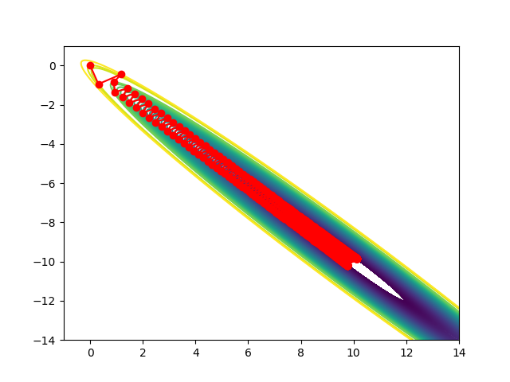
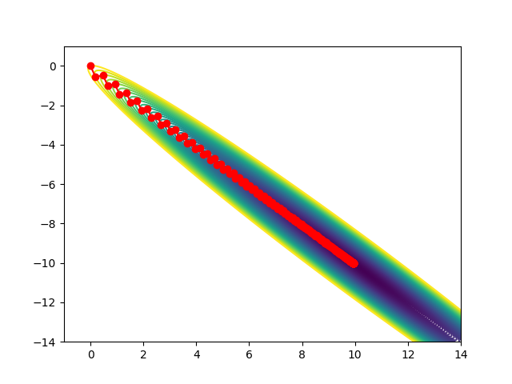
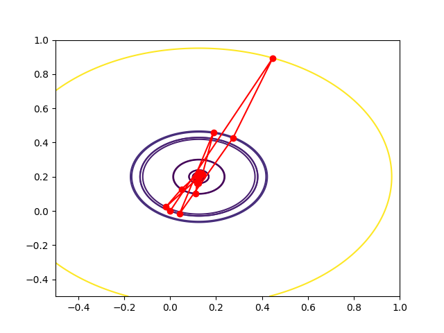
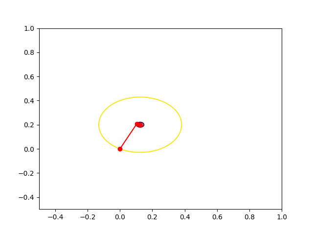
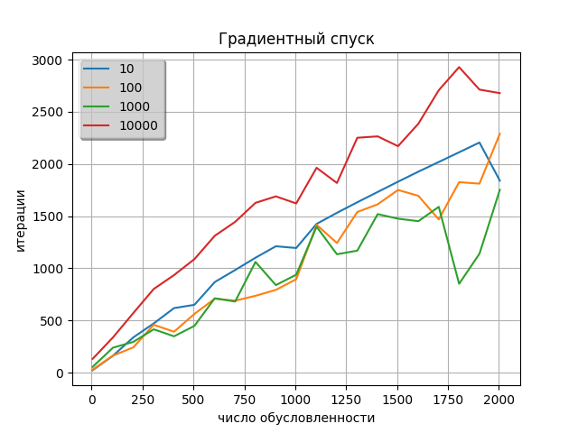
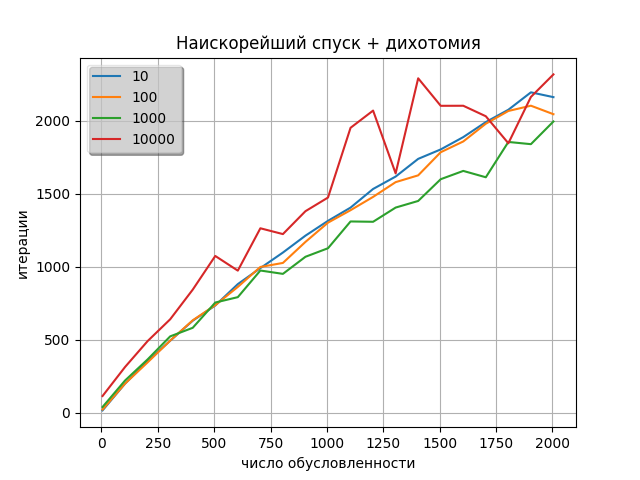
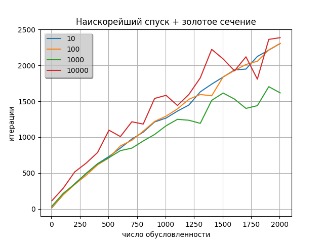
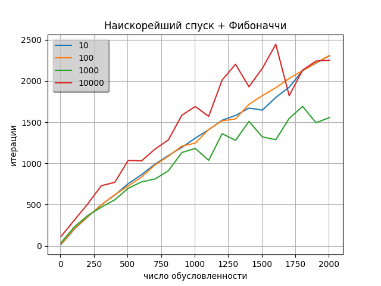

# Отчет

**по лабораторной работе №1 по дисциплине "Методы оптимизации"**

Автор: Ахметов Марсель M3237

### Цель работы:

- Реализовать предложенные методы
- Исследовать их

### Задачи:

1. Реализовать градиентный спуск с постоянным шагом. Исследовать сходимость при различных значениях шага.
2. Подобрать функцию(например, экспоненциальную или ступенчатую) изменения шага, чтобы улучшить сходимость.
3. Реализовать методы одномерного спуска и градиентный спуск на его основе. Сравнить эффективность с точки зрения
   количества вычислений минимизируемой функции и её градиентов
4. Сделать одномерный поиск с учетом условий Вольфе и исследовать эффективность
5. Проанализировать траекторию градиентного спуска для нескольких квадратичных функциях, нарисовать их графики с линиями
   уровня и траекториями
6. Исследовать зависимость числа итераций, необходимоое для сходимости от следующих параметров:
    1. Числа обусловленности k
    2. Размерности пространства n

### Решение:

##### Исследовать сходимость при различных значениях шага.

      def optimize(self, func: BiFunction, stp=True) -> np.ndarray:
         func.reset_applying()
         stop = False
         start_point = copy(self.start)
         lr = self.lr
         while not stop:
            print(start_point, lr)
            grad = func.count_gradient(start_point)
            ln = mod(grad)
            grad = grad / ln
            if stp:
                lr = get_new_alpha(func, start_point, grad, lr)
            next_point = start_point + grad * (-lr)
            if abs(func.apply(start_point) - func.apply(next_point)) <= self.epsilon:
                stop = True
            start_point = next_point
         return start_point

| lr   | steps          |
|------|----------------|
| 1    | don't converge |
| 1e-1 | don't converge |
| 1e-2 | don't converge |
| 1e-3 | don't converge |
| 1e-4 | 2369           |
| 1e-5 | 23417          |
| 1e-6 | 209335         |

Исследовалась функция f = 16 * x^2 + 20 * y^2 - 4 * x - 8 * y + 1

При lr >= 1e-3 наблюдается отсутствие сходимости. Это случается из-за того,
что мы всё время "перескакиваем" локальный минимум из-за слишком большого шага.

При lr <= 1e-4 сходимость есть. Но в данном случае наш шаг слишком маленький,
из-за чего увеличивается количество итераций, необходимое алгоритму для сходимости.

##### Подобрать функцию(например, экспоненциальную или ступенчатую) изменения шага, чтобы улучшить сходимость.

| lr                | steps |
|-------------------|-------|
| lr = (1/2 ^ step) | 12    |
| lr = (1/3 ^ step) | 12    |
| lr = (1/5 ^ step) | 7     |

##### Реализовать методы одномерного спуска и градиентный спуск на его основе. Сравнить эффективность с точки зрения количества вычислений минимизируемой функции и её градиентов

epsilon = 1e-15

| Метод                          | Вычисление функции | Вычисление градиента |
|--------------------------------|--------------------|----------------------|
| Градиентный спуск              | 54                 | 27                   |
| Наискорейший + Дихотомия       | 646                | 11                   |
| Наискорейший + Золотое сечение | 493                | 9                    |
| Наискорейший + Фибоначчи       | 372                | 9                    |

##### Проанализировать траекторию градиентного спуска для нескольких квадратичных функциях, нарисовать их графики с линиями уровня и траекториями

f = 64x^2 + 64y^2 + 128xy - 10x + 30y + 13

| Метод                          | Вычисление функции | Вычисление градиента |
|--------------------------------|--------------------|----------------------|
| Градиентный спуск              | 54                 | 27                   |
| Наискорейший + Дихотомия       | 152                | 4                    |
| Наискорейший + Золотое сечение | 108                | 4                    |
| Наискорейший + Фибоначчи       | 108                | 4                    |

f = 16 * x ** 2 + 20 * y ** 2 - 4 * x - 8 * y + 5

| Метод                          | Вычисление функции | Вычисление градиента |
|--------------------------------|--------------------|----------------------|
| Градиентный спуск              | 804                | 402                  |
| Наискорейший + Дихотомия       | 10754              | 283                  |
| Наискорейший + Золотое сечение | 7614               | 282                  |
| Наискорейший + Фибоначчи       | 7587               | 281                  |

##### Исследовать зависимость числа итераций, необходимоое для сходимости от следующих параметров:

##### 1. Числа обусловленности k

##### 2. Размерности пространства n

Для этого для заданных параметров n и k сгенерируем матрицы следующего вида:

1. a[1][1] = 1,
2. a[i][i] = random (1, k), i = 2...n-1
3. a[n][n] = k.

Заметим, что это диагональная матрица, которую можно представить  в виде вектора.

         lr = 1
         epsilon = 1e-5
         start = (1, .., 1)

Чтобы наши данные были более общими, для каждой пары n и k генерировалось пять
матриц. После чего на каждой из них мы считали необходимое число итераций и брали
среднее между полученными числами.

Для метода градиентного спуска явно просматривается линейная зависимость числа
итераций от числа обусловленности. Что удивительно, размерность не оказывает
большого влияния на число итераций

Для метода наискорейшего спуска так же мы видим линейную зависимость числа
итераций от числа обусловленности. По числу итераций этот метод быстрее, чем метод
градиентного спуска, однако тут не учитывается время на нахождение минимума
одномерной функции. На практике этот метод искал минимум на сгенерированных
матрицах гораздо дольше